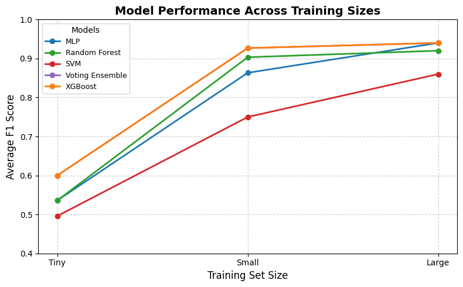

# Experiment Introduction
This project was developed as part of Google Summer of Code 2025 with LINQS: Autograder under UC OSPO. The goal of the project was to design and implement a code detection system capable of producing confidence scores for identifying AI-generated code.

## Experiment Setup
## Datasets
This project utilizes three open-source datasets for training and evaluation:
- [Dataset 1](https://github.com/a0ms1n/AI-Code-Detector-for-Competitive-Programming)
- [Dataset 2](https://github.com/zzarif/AI-Detector/tree/main)  
- [Dataset 3](https://github.com/Back3474/AI-Human-Generated-Program-Code-Dataset/blob/main)

During training, files are named according to their dataset of origin. 
In cases where multiple datasets are combined, filenames follow a concatenated naming convention, e.g., python_1_java_2 indicates a combination of python subset of dataset 1 and java subset of dataset 2.

## Dataset Format
The project expects datasets in JSON Lines (JSONL) format.
Each entry must include the following keys:

`writer` : Indicates whether the code was written by a human or generated by AI.  
`code` : Contains the corresponding code snippet.

```json
{"writer": "AI", "code": "#include <bits/stdc++.h>\nusing namespace std;\n\nint main() {\n    ios_base::sync_with_stdio(false);\n    cin.tie(nullptr);\n    \n    int t;\n    cin >> t;\n    while (t--) {\n        string s;\n        cin >> s;\n        char min_char = *min_element(s.begin(), s.end());\n        size_t pos = s.find(min_char);\n        string a(1, min_char);\n        string b = s.substr(0, pos) + s.substr(pos + 1);\n        cout << a << \" \" << b << \"\\n\";\n    }\n    \n    return 0;\n}\n"}
{"writer": "Human", "code": "#include <iostream>\n#include <cmath>\n#include <cstdio>\nusing namespace std;\nint getDown(int n)\n{\n int ans=0;\n while(n>1)\n {\n  ans++;\n  n>>=1;\n }\n return ans;\n}\n#define N 300\nint l[N]={1};\nint main()\n{\n int i,j=2,tmp,n,a,b,p,q;\n tmp=2;\n for(i=2;i<N;i+=2)\n {\n  l[i]=j;\n  if(i==tmp)\n  {\n   tmp<<=1;\n   j++;\n  }\n }\n scanf(\"%d%d%d\",&n,&a,&b);\n p=min(a,b);\n q=max(a,b);\n if(p==q)\n {\n  printf(\"0\\n\");\n }\n else\n {\n  p=p&1?p:p-1;\n  q=q&1?q:q-1;\n  int cha=q-p;\n  //cout<<cha<<\" \"<<getDown(n);\n  if(l[cha]==getDown(n))\n  {\n   printf(\"Final!\\n\");\n  }\n  else\n  {\n   printf(\"%d\\n\",l[cha]);\n  }\n }\n return 0;\n} "}
```

## Dataset Preparation
- Data from the open-source datasets mentioned above was extracted for each language using the scripts:
  
  - [`source_files_extractor.py`](../data_scripts/source_files_extractor.py)
  - [`csv_data_extraction.py`](../data_scripts/csv_data_extraction.py)
  - [`json_data_extraction.py`](../data_scripts/json_data_extraction.py)
    
- The extracted language specific datasets are available in the [curated dataset directory](curated_datasets).
- These language specific datasets were then merged using [`data_scripts/merge_json.py`](../data_scripts/merge_json.py).
- Finally, a powerset of the merged language datasets was generated by using [`powerset_script.py`](../scripts/powerset_script.py), resulting in 63 unique dataset combinations.

## Methodology
- Each dataset in the powerset was trained and evaluated against every other dataset in the powerset.
- This resulted in a total of 3,969 training–testing runs.
- Embeddings were extracted by using [CodeBERT](https://github.com/microsoft/CodeBERT).
- The machine learning models were trained and evaluated using [`train_script.py`](../scripts/train_script.py).
- The following machine learning models were employed in the training process:

  - [**Random Forest**](https://en.wikipedia.org/wiki/Random_forest)  
  - [**Support Vector Machine (SVM)**](https://en.wikipedia.org/wiki/Support_vector_machine)
  - [**XGBoost**](https://en.wikipedia.org/wiki/XGBoost) 
  - [**Multi-Layer Perceptron (MLP)**](https://en.wikipedia.org/wiki/Multilayer_perceptron)
  - [**Ensemble Model**](https://en.wikipedia.org/wiki/Ensemble_learning): [Soft Voting Classifier](https://www.geeksforgeeks.org/machine-learning/voting-classifier/) combining the above four models.

- The complete experiment results can be found [here](https://docs.google.com/spreadsheets/d/1otK4V8OKmIkNpBL08ZQCtp5fkIpYQJi7aa6SDMDiWcE/edit?usp=sharing).

## Research Questions
- **RQ1**: “Is it better to use a model trained on multiple languages, or a model trained with fewer data points?”
- **RQ2**: “Which family of models performs the best?“
- **RQ3**: “How well do models trained on one language generalize to unseen languages?“
- **RQ4**: “How does dataset size affect performance?“

## Results
### RQ1: Is it better to use a model trained on more than one language, or a model with few data points?
**Steps**:  
We performed two sets of comparisons:
- Training and testing on same language.
- Training on multiple languages and testing on each language.

**Case 1: Training and testing on same language**
| Training Languages | Testing Languages |   F1   |
|:------------------:|:-----------------:|:------:|
| cpp                | cpp               | 0.92   |
| java               | java              | 0.90   |
| javascript         | javascript        | 0.67   |
| python             | python            | 0.91   |

**Note**: PHP and Go were excluded from the experiment due to lack of sufficient data.

**Case 2:** 
1. Testing on C++
   
|       Training Languages       | Testing Language |   F1   | Accuracy |
|:------------------------------:|:----------------:|:------:|:--------:|
| cpp, javascript                | cpp              | 0.13   | 0.50     |
| java, cpp                      | cpp              | 0.92   | 0.92     |
| java, cpp, javascript          | cpp              | 0.13   | 0.50     |
| python, cpp                    | cpp              | 0.92   | 0.92     |
| python, cpp, javascript        | cpp              | 0.13   | 0.50     |
| python, java, cpp              | cpp              | 0.92   | 0.92     |
| python, java, cpp, javascript  | cpp              | 0.13   | 0.50     |

2. Testing on Java
   
|      Training Languages      | Testing Language |   F1   | Accuracy |
|:----------------------------:|:----------------:|:------:|:--------:|
| java, cpp                    | java             | 0.62   | 0.45     |
| java, cpp, javascript        | java             | 0.64   | 0.50     |
| java, javascript             | java             | 0.64   | 0.50     |
| python, java                 | java             | 0.90   | 0.90     |
| python, java, cpp            | java             | 0.62   | 0.45     |
| python, java, cpp, javascript| java             | 0.64   | 0.50     |
| python, java, javascript     | java             | 0.64   | 0.50     |

3. Testing on Javascript
   
|       Training Languages       | Testing Language |   F1   | Accuracy |
|:------------------------------:|:----------------:|:------:|:--------:|
| cpp, javascript                | javascript       | 0.67   | 0.70     |
| java, cpp, javascript          | javascript       | 0.67   | 0.70     |
| java, javascript               | javascript       | 0.67   | 0.70     |
| python, cpp, javascript        | javascript       | 0.67   | 0.70     |
| python, java, cpp, javascript  | javascript       | 0.67   | 0.70     |
| python, java, javascript       | javascript       | 0.67   | 0.70     |
| python, javascript             | javascript       | 0.67   | 0.70     |

4. Testing on Python
   
|       Training Languages       | Testing Language |   F1   | Accuracy |
|:------------------------------:|:----------------:|:------:|:--------:|
| python, cpp                    | python           | 0.65   | 0.48     |
| python, cpp, javascript        | python           | 0.22   | 0.33     |
| python, java                   | python           | 0.71   | 0.62     |
| python, java, cpp              | python           | 0.65   | 0.48     |
| python, java, cpp, javascript  | python           | 0.22   | 0.33     |
| python, java, javascript       | python           | 0.22   | 0.33     |
| python, javascript             | python           | 0.22   | 0.33     |   

**Analysis**:
- Adding C++ to java during training dramatically improved performance when testing on C++ (F1 0.92 vs. 0.69).
- Adding JavaScript caused performance to collapse (F1 0.13), showing that some languages in the mix can be detrimental.
- Python had a neutral effect - it neither helped nor hurt significantly.

**Conclusion**:
- Training on multiple languages is not always beneficial.
- The impact depends on the similarity and compatibility of languages:
  - Java with C++ pairing improved generalization.
  - Java with JavaScript pairing degraded performance severely.

### RQ2: Which family of models performs the best?
**Steps**:
- The dataset already contains a `Model` column, which represents the family of models (e.g., Random Forest, SVM, Random Forest etc.).
- We created a Train_Size_Type column using the formula:
  
  ```excel
  =IF(G2 < 40, "Tiny",
    IF(G2 < 100, "Small",
        IF(G2 < 250, "Medium",
            IF(G2 < 500, "Large", 
                "Large"
            )
        )
    ))
  
This classified training datasets into four groups: `Tiny`, `Small`, `Medium`, and `Large`.  
- For this analysis, we considered only rows where the training and testing languages were the same
- For each model and size group, we computed the average F1 score.

**Results (by training size)**:
| Model               | Tiny | Small | Large |
|---------------------|:----:|:-----:|:-----:|
| **MLP**             | 0.54 | 0.86  | 0.94  |
| **Random Forest**   | 0.54 | 0.90  | 0.92  |
| **SVM**             | 0.50 | 0.75  | 0.86  |
| **Voting Ensemble** | 0.60 | 0.93  | 0.94  |
| **XGBoost**         | 0.60 | 0.93  | 0.94  |

**Results (overall averages)**:
| Model           | Avg F1   |
| :--------------:| :------: |
| Voting Ensemble | **0.94** |
| XGBoost         | **0.94** |
| MLP             | 0.92     |
| Random Forest   | 0.92     |
| SVM             | 0.83     |

**Analysis**:
- **Tiny datasets**: All models perform poorly (<0.60 F1), highlighting the difficulty of learning with very limited data.
- **Scaling with data**:
  - MLP, Voting Ensemble, and XGBoost benefit most from larger datasets, reaching ~0.94 F1.
  - Random Forest improves steadily but slightly lags behind at large scale (0.92).
  - SVM performs the worst overall, though it improves with more data.
- **Consistency**: Voting Ensemble and XGBoost not only achieve the highest averages but also show strong performance across sizes.

**Conclusions**:
- Voting Ensemble and XGBoost are the best-performing model families overall, achieving ~0.94 F1 on average.
- MLP and Random Forest are strong contenders, particularly when enough training data is available.
- SVM lags behind, especially on small datasets.
- Performance is strongly tied to dataset size, with most models requiring at least “Small” training sets to perform competitively.

### RQ3: How well do models trained on one language generalize to unseen languages? 
**Steps**:
- We created two tables:
  - Self-performance table: Models trained and tested on the same language.
  - Cross-language table: Models trained on one language but tested on other, unseen languages.
- We then compared the F1 and Accuracy scores to evaluate the degree of generalization.

Results (Same training and testing language):
| Training Languages | Testing Languages |   F1   |
|:------------------:|:-----------------:|:------:|
| cpp                | cpp               | 0.92   |
| java               | java              | 0.90   |
| javascript         | javascript        | 0.67   |
| python             | python            | 0.91   |

*PHP is excluded due to lack of sufficient data

- Models perform very strongly on cpp, java, and python (F1 ≥ 0.90).
- JavaScript lags (F1 = 0.67), suggesting less reliable representation.
  
The other table we created, showed the performance of languages when tested on varied unseen languages.

Results (Cross-language generalization):
| Training Languages | Testing Languages |   F1   | Accuracy |
|:------------------:|:-----------------:|:------:|:--------:|
| java               | java              | 0.90   | 0.90     |
| java               | cpp               | 0.69   | 0.65     |
| java               | python            | 0.71   | 0.62     |

- Seen Language (java -> java):
  - Strong specialization (Acc = 0.90, F1 = 0.90).
- Unseen Languages:
  - java -> cpp: Moderate generalization (F1 = 0.69).
  - java -> python: Slightly weaker but comparable (F1 = 0.71).

Analysis:
- Performance is highest when training and testing on the same language (as expected).
- Generalization on unseen languages exists but is partial:
- Java-trained models transfer moderately well to C++ and Python, indicating some shared structural and syntactic features.
- Cross-language scores (0.69–0.71 F1) are well above random, showing that learned representations are not language-specific.
- Weak spots:
  - JavaScript shows lower performance in same train and test setup, and by extension, it may be a poor contributor in multilingual training setup.

**Conclusions**:
- Models trained on one language retain useful representations for unseen languages, but the degree of transfer depends heavily on similarity between the two languages and dataset quality.
- Strong transfer is observed between Java and structurally similar languages (C++, Python).
- Some languages (e.g., JavaScript) underperform, highlighting that less or noisy datasets limit both specialization and generalization.

### RQ5: How does dataset size affect performance?
**Steps**:
- Training sizes were bucketed into four categories:
  - Tiny (< 40 samples)
  - Small (< 100 samples)
  - Medium (< 250 samples)
  - Large (> 250 samples)
- For each bucket, we computed the average F1 score per model.
- Performance trends were visualized in the graph below.
  


**Analysis**
- Positive correlation with size:
  - Across all models, performance improves as dataset size increases, confirming that more training data consistently benefits model learning.
- Saturation effect:
  - The improvement curve is steep from Tiny → Small, but gains taper off from Small → Large.
  - This suggests diminishing returns — after a certain point, adding more data yields only marginal improvements.

## Experiment Conclusion
- Multilingual training is not always beneficial — adding dissimilar languages (e.g., JavaScript with Java) can hurt performance, while structurally similar languages (e.g., Java + C++) can improve it.
- Model family matters — Voting Ensemble and XGBoost consistently deliver the highest performance (~0.94 F1), followed closely by MLP and Random Forest, while SVM lags behind.
- Cross-language generalization is possible but uneven — models trained on one language retain useful features for unseen ones, with stronger transfer between similar languages (Java → C++) and weak transfer for low-resource languages (PHP, JavaScript).
- Dataset size has a strong effect — performance rises steeply from Tiny → Medium datasets, but gains plateau after Medium, showing diminishing returns.

## Future Work
- Due to time constraints we could not perform significance tests.
